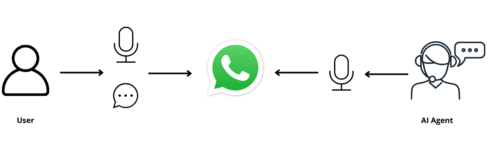

# whatsapp-langgraph-ai-agent

This project implements a **WhatsApp AI Agent** that engages in natural conversations through WhatsApp, providing support and responses in both text and voice formats. Using **LangGraph**, **FastAPI**, **PostgreSQL**, and the **Groq** LLM, this agent can understand text messages, transcribe voice notes, and respond in a synthesized speech.

👉 The agent acts as a therapist named Dr. Sofia, providing compassionate and empathetic guidance to users!

💡 You can modify the agent's personality by editing the `system_prompt.py` file:

```python
prompt = """You are Dr. Sofia, a compassionate and empathetic therapist.
Its goal is to provide supportive, non-judgmental guidance and help users 
to explore your emotions and thoughts."""
```

<p align="center">
  
</p>

---

## Table of Contents
- [whatsapp-langgraph-ai-agent](#whatsapp-langgraph-ai-agent)
  - [Table of Contents](#table-of-contents)
  - [Key Features](#key-features)
  - [Built With](#built-with)
  - [Use Cases](#use-cases)
  - [Project Structure](#project-structure)
  - [Get Started](#get-started)
    - [Prerequisites](#prerequisites)
  - [Development Notes](#development-notes)
    - [Resetting Conversations](#resetting-conversations)
  - [Troubleshooting](#troubleshooting)

---

## Key Features

The WhatsApp AI Agent provides:

1. **Multi-Modal Communication:**
   - Process both text and voice messages
   - Respond with synthesized voice
   - Transcribe voice messages using Whisper

2. **Conversation Management:**
   - Message aggregation with configurable wait time
   - Persistent conversation state using PostgreSQL
   - Support for multiple languages

3. **Natural Language Understanding:**
   - Powered by Groq's LLMs. Visit [Groq](https://groq.com/) to create your API key and see the available LLMs
   - Contextual responses maintaining conversation flow
   - Customizable system prompt for different personalities

---

## Built With

- **LangGraph:** Enables sophisticated, stateful agent workflows
- **FastAPI:** Provides the webhook endpoint and API infrastructure
- **PostgreSQL:** Manages conversation states and history
- **WPPConnect:** Handles WhatsApp integration
- **Groq:** Powers the language model for natural conversations and transcribes voice messages to text
- **gTTS:** Converts text responses to speech

---

## Use Cases

This WhatsApp AI Agent is perfect for:
- **Mental Health Support:** Providing initial emotional support and guidance
- **Customer Service:** Automating responses in multiple modalities
- **Educational Support:** Offering explanations and guidance
- **Information Services:** Delivering information through voice and text

---

## Project Structure

```
.
├── app/
│   ├── agent.py               # LangGraph agent implementation
│   ├── config/
│   │   ├── config.py         # Configuration management
│   │   └── logging.py        # Logging setup
│   ├── src/
│   │   └── wppconnect/
│   │       └── api.py        # WhatsApp integration
│   └── utils/
│       └── graph_utils.py    # Graph utilities
├── main.py                   # FastAPI application
├── system_prompt.py          # Agent personality definition
├── requirements.txt          # Project dependencies
└── .env-example             # Environment variables template
```

---

## Get Started

### Prerequisites

- Python 3.10+
- PostgreSQL
- Node.js 14+


1. **Configure Environment:**
   Copy `.env.example` to `.env` and configure:
   ```env
   # WPPConnect Configuration
   WPPCONNECT_BASE_URL=http://localhost:21465
   WPPCONNECT_SECRET_KEY=THISISMYSECURETOKEN
   WPPCONNECT_SESSION_NAME=NERDWHATS_AMERICA
   WPPCONNECT_TOKEN=your_generated_token

   # GROQ Configuration
   GROQ_API_KEY=your_groq_api_key

   # Postgres Configuration
   PSQL_USERNAME=db_user
   PSQL_PASSWORD=db_password
   PSQL_HOST=db_host
   PSQL_PORT=5432
   PSQL_DATABASE=db_name
   PSQL_SSLMODE=db_sslmode
   PSQL_CONNECTION_STRING=postgresql://${PSQL_USERNAME}:${PSQL_PASSWORD}@${PSQL_HOST}/${PSQL_DATABASE}?sslmode=${PSQL_SSLMODE}

   # Whatsapp Configuration
   WAIT_TIME=1
   LANGUAGE=en
   ```

2. **Start the Application:**
   ```bash
   uvicorn main:app --host 0.0.0.0 --port 8000 --reload
   ```

---

## Development Notes

- Adjust `WAIT_TIME` to balance response time and message aggregation
- Set `LANGUAGE` based on your target audience
- Monitor PostgreSQL storage for conversation histories

### Resetting Conversations

To start fresh conversations, run:
```sql
DO $$
BEGIN
    EXECUTE format('DELETE FROM checkpoint_blobs');
    EXECUTE format('DELETE FROM checkpoint_migrations');
    EXECUTE format('DELETE FROM checkpoint_writes');
    EXECUTE format('DELETE FROM checkpoints');
END $$;
```
⚠️ WARNING: This deletes ALL conversation histories. Backup important data first.

---

## Troubleshooting

Common issues and solutions:

1. **Database Connection Issues:**
   - Verify PostgreSQL credentials
   - Check connection string format
   - Ensure database exists

2. **WPPConnect Problems:**
   - Confirm server is running
   - Verify token authorization
   - Check webhook URL configuration

3. **Voice Message Issues:**
   - Verify file permissions
   - Check temporary storage space
   - Confirm language configuration

4. **Agent Response Problems:**
   - Monitor Groq API status
   - Verify PostgreSQL checkpointer setup

For detailed error messages, check the application logs.
